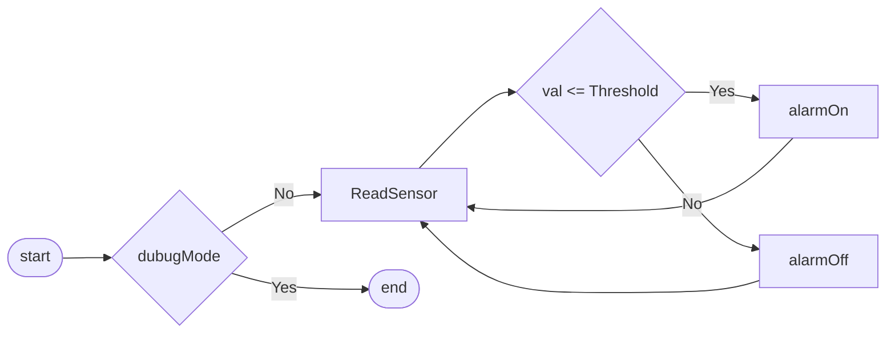

###### Sensor Reading Flow Chart
the chart below describes the program flow chart that will be run by at a desired time interval(e.g. every 10 seconds). A

```c++
uint32_t readSensor(uint32_t debugMode){
    ...
}
```
At the start of the process, the function will check if the

```c++
...
if(!debugMode){
    //read values from sensor
}
return 0;
```